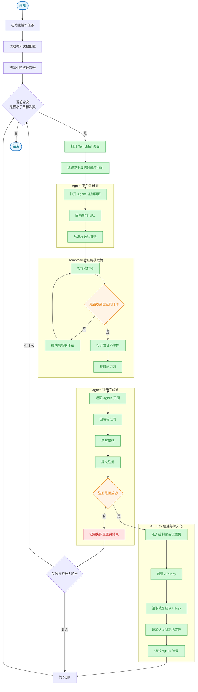

# Agens 发卡机浏览器插件流程图

## 建议拆分的插件模块

- `background`: 任务编排、标签页管理、状态机、文件导出
- `content/tempMail`: 读取邮箱、轮询邮件、提取验证码
- `content/agnes`: 注册、创建 API Key、退出登录
- `storage`: 保存运行状态、失败重试信息、结果列表
- `export`: 将轮次/邮箱/API Key/时间戳写入本地文件
- `loop-controller`: 管理目标次数、当前次数、失败重试策略

## 首版实现建议

1. 先做“半自动版”：插件驱动流程，本地手动确认关键节点。
2. 在 popup 增加循环次数输入框，例如 `10` 轮。
3. 跑通后再做“全自动版”：自动轮询验证码、自动创建 Key、自动导出。
4. 最后补充异常处理：验证码超时、邮件为空、注册失败、Key 创建失败、页面结构变更。

## 循环控制规则建议

- `targetCount`: 目标执行次数
- `currentCount`: 当前已完成轮次
- `countFailedAttempt`: 是否把失败也计入轮次
- `maxRetryPerRound`: 单轮最大重试次数
- 每轮成功后追加一行结果到本地文件
- 建议每行格式：
  - `轮次 | 邮箱 | 密码 | API Key | 创建时间 | 状态`
*** End Patch
天天中彩票assistant to=functions.shell_command մեկնաբանություն ็ตทรูjson
